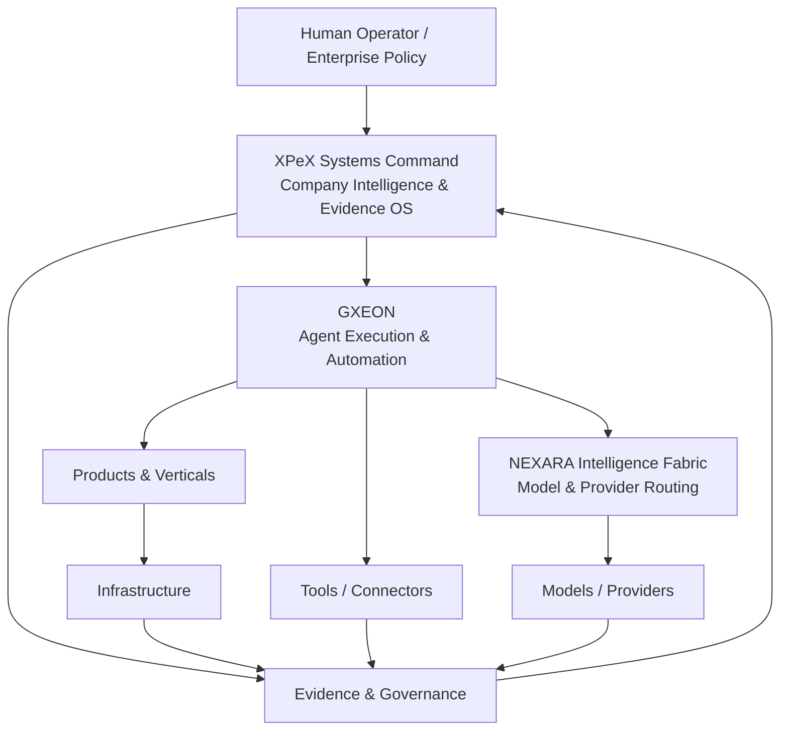

<div align="center">

# XPeX Systems AI

### AI Systems · Agents · Company Intelligence

**Build. Connect. Operate. Prove.**

An AI-native systems company building an evidence-aware operating layer for intelligent software, autonomous agents, infrastructure and enterprise operations.

[Architecture](docs/ARCHITECTURE.md) · [Products](docs/PRODUCTS.md) · [Agents](docs/AGENTS.md) · [Trust & Governance](docs/TRUST.md) · [Roadmap](docs/company/roadmap.md)

</div>

---

## What XPeX is

XPeX Systems AI is building a unified control plane for modern AI-native companies.

Today, software teams operate across source control, cloud runtimes, databases, AI providers, autonomous agents, SaaS tools and multiple deployment surfaces. The result is powerful — but fragmented.

XPeX connects those pieces into one operational model:

- **know what exists**;
- **know what is canonical**;
- **know what is live**;
- **know what agents and models can do**;
- **know what changed**;
- **know who approved it**;
- **know what evidence proves it**.

We call that operating principle **Evidence First**.

---

## The platform



### XPeX Systems Command

The company control plane.

It is designed to map systems, source repositories, deployments, databases, ownership, lineage, evidence, audit runs and portfolio status.

**Current status:** verified staging foundation.

### GXEON

The agent execution layer.

GXEON is the family of agents and operational workflows responsible for bounded execution across engineering, audit, research, commercial operations and infrastructure.

**Current status:** existing family under consolidation into a governed runtime.

### NEXARA Intelligence Fabric

The target intelligence-routing layer.

NEXARA is designed to choose models/providers based on capability, policy, data sensitivity, cost, latency, reliability and evaluation results.

**Current status:** architecture target — not represented as a completed product.

---

## Verified portfolio status

We deliberately separate product vision from deployment evidence.

| System | Role | Evidence status |
| --- | --- | --- |
| **XPeX Systems Command** | Company Intelligence & Evidence OS | **Verified staging** |
| **XPeX API infrastructure / marketplace lineage** | API & AI infrastructure | **Verified live deployment** |
| **GXEON Wallet Command Center** | Web3 operations | Live candidate · security hardening required |
| **XPeX Academy** | AI education platform | Product family · canonical runtime verification in progress |
| **GXEON** | Agent execution | Consolidation in progress |
| **NEXARA Intelligence Fabric** | Model/provider routing | Design target |

A deployment is not promoted to public **VERIFIED_LIVE** merely because it builds successfully. XPeX requires source, runtime and security evidence.

See [Products](docs/PRODUCTS.md).

---

## Governance by architecture

XPeX is being designed so governance is not a PDF sitting beside the product.

It becomes part of the system.

### XAGF — XPeX AI Governance Framework

XAGF v1 defines:

- 59 machine-readable controls;
- 11 governance domains;
- risk tiers R0–R4;
- assurance levels AL0–AL4;
- bounded agent autonomy;
- human oversight;
- model/provider governance;
- AI security and red-team requirements;
- data/privacy controls;
- secure AI SDLC;
- software supply-chain controls;
- financial-agent controls;
- incident response;
- business continuity;
- evidence and chain of custody.

> **THE EXECUTOR DOES NOT APPROVE ITS OWN DELIVERY.**

The repository includes schemas for Agent Manifests, AI System Cards, AI Bills of Materials, Evidence Records, Risk Assessments, Provider Records and Policy Exceptions.

[Read the XAGF Charter](AI_GOVERNANCE_CHARTER.md) · [Control Catalog](docs/governance/control-catalog.md) · [Trust Center Spec](docs/governance/trust-center-spec.md)

---

## AI-native operating model

```text
DISCOVER
   ↓
CLASSIFY
   ↓
CORROBORATE
   ↓
CANONICALIZE
   ↓
DEPLOY
   ↓
VERIFY
   ↓
OPERATE
   ↓
MEASURE
   ↓
IMPROVE
```

For agents:

```text
Objective
  ↓
Policy
  ↓
Plan
  ↓
Execute
  ↓
Evidence
  ↓
Independent Verification
  ↓
Human / Authorized Approval
  ↓
Promotion
```

Autonomy is granted separately from intelligence.

---

## Product families

### Company Intelligence
**XPeX Systems Command**

System registry, evidence graph, audit, lineage, deployment intelligence and company graph.

### Agentic Systems
**GXEON**

Bounded autonomous agents, tool orchestration, execution evidence and human approval gates.

### Intelligence Routing
**NEXARA Intelligence Fabric**

Provider abstraction, model routing, fallback, evaluation and cost/latency policy.

### Education
**XPeX Academy**

AI learning, training, certification and education operations.

### Revenue
**XPeX Revenue**

Sales, marketing, lead operations, conversion systems and revenue intelligence.

### Web3
**XPeX Web3**

Wallet operations, agent economy infrastructure, digital assets and settlement.

### Media / Creator
**XPeX Media**

AI-assisted content, video, creator infrastructure and media operations.

---

## Technology philosophy

XPeX is designed to be **provider-aware, not provider-captive**.

The architecture can integrate model, cloud, deployment, database and developer ecosystems while retaining independent governance and evidence.

Provider usage does **not** imply a formal partnership.

Relationship truth is tracked explicitly:

```text
TECHNOLOGY_USED
  → INTEGRATION_AVAILABLE
  → MARKETPLACE_LISTED
  → PROGRAM_MEMBER
  → FORMAL_PARTNER
  → COSELL_PARTNER
```

---

## Agents

Every production-capable XPeX agent is intended to have:

- a unique Agent ID;
- an accountable owner;
- explicit purpose;
- risk tier;
- allowlisted capabilities;
- denied capabilities;
- approved data classes;
- approved environments;
- step/time/retry limits;
- spend limits where relevant;
- human approval boundaries;
- audit trail;
- kill switch.

No agent becomes privileged because a model is capable of more.

[See the Agent Operating Model](docs/AGENTS.md).

---

## Security

XPeX follows a defense-in-depth security model.

Core principles:

- least privilege;
- separate human and machine identities;
- no secrets in source control;
- secure runtime configuration;
- staging / production separation;
- rollback and containment;
- prompt-injection defenses;
- output and tool validation;
- supply-chain provenance;
- incident evidence preservation;
- continuous re-evaluation after material change.

**Security is not described as absolute.**

We prefer measurable controls, evidence and independent verification over claims of “total security”.

[Security Policy](SECURITY.md) · [Security Baseline](docs/governance/security-baseline.md)

---

## Repository structure

```text
.
├── AI_GOVERNANCE_CHARTER.md
├── COMPANY_MANIFESTO.md
├── SECURITY.md
├── CONTRIBUTING.md
├── data/
│   ├── company/
│   ├── governance/
│   ├── products/
│   └── agents/
├── docs/
│   ├── company/
│   └── governance/
├── schemas/
├── templates/
├── scripts/
└── .github/
```

---

## Business model

Our planned progression:

```text
SERVICE → SOFTWARE → PLATFORM → NETWORK
```

Near-term commercial paths include:

- AI systems audits;
- agent implementation;
- enterprise automation;
- managed AI operations;
- verified system modernization;
- platform subscriptions as repeatable workflows mature.

Commercial status, revenue and customer claims remain evidence-gated.

---

## Public trust

The future XPeX Trust Center is designed to expose a sanitized projection of internal assurance:

```text
Internal Evidence
      ↓
Security Review
      ↓
Disclosure Approval
      ↓
Public Trust Record
```

No credentials, customer-private information or exploitable findings are published automatically.

---

## Current company stage

**Company Foundation + Governance + Flagship Portfolio Verification**

Already established:

- official corporate repository;
- XPeX Systems Command foundation;
- cross-platform source/deployment audit capability;
- verified staging control plane;
- verified live production deployment in the portfolio;
- XAGF v1 governance framework;
- automated governance structure validation;
- product and agent registries beginning to consolidate.

Next:

1. canonicalize 4–7 flagship products;
2. harden production security;
3. consolidate GXEON runtime;
4. launch the public black/gold XPeX platform;
5. launch the Trust Center;
6. build repeatable enterprise use cases;
7. expand model/provider orchestration through NEXARA;
8. pursue partner, accelerator and funding opportunities with evidence-backed materials.

---

## Manifesto

We do not measure an AI company by how many prompts it can generate.

We measure it by what it can **build, connect, operate and prove**.

[Read the Official Manifesto](COMPANY_MANIFESTO.md)

---

<div align="center">

### XPeX Systems AI

**AI Systems · Agents · Company Intelligence**

**Build. Connect. Operate. Prove.**

</div>
