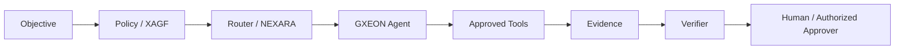

# GXEON — Agent Operating Model

GXEON is the agent execution layer of XPeX Systems AI.

## Goal

Turn AI from a conversational interface into a governed execution system.

## Agent architecture



## Planned operational roles

### GXEON Auditor
Discovers and correlates systems, repositories, deployments, evidence and governance gaps.

### GXEON Engineer
Implements scoped technical changes in approved repositories and environments.

### GXEON Security
Runs security checks, evidence collection, policy tests and remediation workflows.

### GXEON Research
Performs structured research and evidence-backed synthesis.

### GXEON Revenue
Supports bounded commercial workflows, pipeline analysis and approved outreach operations.

### GXEON Operations
Monitors infrastructure, runtime state and operational workflows.

These roles are a governed target roster. A role is not claimed as continuously autonomous until its runtime identity, permissions, limits and monitoring are implemented.

## Agent manifest

Production-capable agents require:
- Agent ID;
- owner;
- purpose;
- risk tier;
- allowed capabilities;
- denied capabilities;
- data classes;
- environments;
- human-approval conditions;
- max steps;
- max runtime;
- retry limit;
- budget limit where relevant;
- kill switch;
- review date.

Schema:
`schemas/agent-manifest.schema.json`

## Autonomy

```text
L0 Assistant
L1 Read-only Agent
L2 Bounded Operator
L3 Workflow Agent
L4 Autonomous Domain Agent
L5 Strategic Autonomy (not enabled by default)
```

Intelligence does not grant authority.

## High-risk controls

Financial, destructive, credential, legal and safety-critical actions are separately controlled.

See:
- `docs/governance/agent-governance.md`
- `docs/governance/autonomy-levels.md`
- `docs/governance/financial-agent-controls.md`
