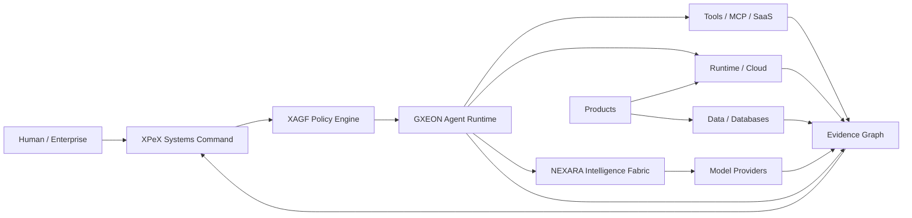

# XPeX Systems AI — Enterprise Architecture

## Operating thesis

XPeX Systems AI is an AI-native systems company.

The architecture separates four concerns that are often mixed together:

1. **company truth** — what exists and what is canonical;
2. **intelligence** — which models/providers reason about the task;
3. **execution** — which agents/tools can act;
4. **assurance** — which evidence proves the action and its result.

## Reference architecture



## 1. Company control plane

### XPeX Systems Command

Responsibilities:
- Systems
- Assets
- Sources
- Accounts
- Evidence
- Audit Runs
- Repositories
- Deployments
- Databases
- Ownership
- Lineage
- Canonicalization
- Portfolio state
- Company Graph

It is not intended to duplicate the full feature set of GitHub, Vercel, Railway, Supabase or other providers. It stores the company's normalized operational truth and evidence links.

## 2. Agent execution plane

### GXEON

GXEON is responsible for:
- planning;
- bounded execution;
- tool orchestration;
- approval gates;
- task state;
- retries;
- escalation;
- cost/result telemetry;
- execution evidence.

Runtime authority is separate from model intelligence.

## 3. Intelligence plane

### NEXARA Intelligence Fabric

Target capabilities:
- provider abstraction;
- model registry;
- policy-aware routing;
- data-class restrictions;
- cost/latency routing;
- fallback;
- evaluations;
- model-change governance;
- provider telemetry.

NEXARA remains a design target until implemented and independently verified.

## 4. Governance plane

### XAGF

XAGF governs:
- risk;
- identity;
- agents;
- models;
- data;
- security;
- supply chain;
- runtime;
- incidents;
- third parties;
- evidence.

The long-term goal is for policy to be enforced at runtime boundaries, especially before privileged tool calls.

## 5. Evidence plane

Every material action should eventually be representable as:

```text
Who
 + Agent
 + Model
 + Policy
 + Tool
 + Source
 + Commit
 + Deployment
 + Action
 + Approval
 + Result
 + Verification
 = Evidence Record
```

## 6. Public boundary

The public XPeX platform exposes a sanitized projection of the private company graph.

Public:
- approved products;
- approved architecture;
- verified statuses;
- demos;
- sanitized evidence;
- trust controls.

Private:
- credentials;
- sensitive security findings;
- customer data;
- internal audit details;
- unrestricted infrastructure metadata.

## 7. Enterprise target

The enterprise version should support:
- multi-tenant isolation;
- organization policy;
- customer connectors;
- customer evidence graph;
- agent permissions;
- provider routing;
- audit exports;
- security posture;
- billing;
- enterprise identity;
- observability.

## Architectural rule

**Provider integrations are replaceable. Company truth and governance remain controlled by XPeX.**
