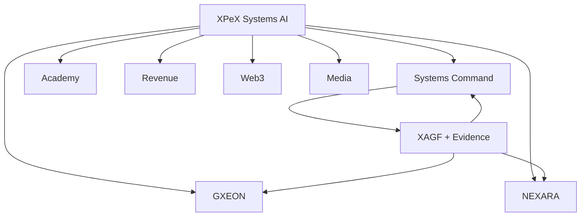

# XPeX Systems AI — Company Showcase

## One company. One evidence-aware operating model.

XPeX Systems AI is building a company architecture for the age of autonomous software.

The central thesis is simple:

> Intelligence becomes enterprise infrastructure only when it can be governed, operated, observed and proved.

## What is already real

### Corporate foundation
- official public corporate repository;
- company manifesto;
- product architecture;
- AI-native operating model;
- public product/system registry;
- company graph;
- investor brief;
- technical status page.

### Governance
- XAGF v1;
- 59 machine-readable controls;
- 11 control domains;
- risk tiers R0–R4;
- assurance levels AL0–AL4;
- agent governance;
- financial-agent controls;
- model/provider governance;
- red-team and AI-security standards;
- incident, recovery and evidence standards.

### Automated gates
- Governance Validation;
- Public Truth Validation;
- System Registry Validation.

### Verified runtime evidence
- XPeX Systems Command — verified staging foundation;
- XPeX API Fabric lineage — verified live production runtime.

## The system

## How to explore

### For engineering
Start with:
- [Architecture](ARCHITECTURE.md)
- [Verified Systems](../systems/README.md)
- [Agents](AGENTS.md)
- [System Onboarding](SYSTEM_ONBOARDING.md)

### For security / governance
Start with:
- [Trust](TRUST.md)
- [XAGF Charter](../AI_GOVERNANCE_CHARTER.md)
- [Control Catalog](governance/control-catalog.md)
- [Security Policy](../SECURITY.md)

### For partners
Start with:
- [Partner Policy](PARTNERS.md)
- [Technology Map](TECHNOLOGY_MAP.md)
- [Public Status](../STATUS.md)

### For investors / accelerators
Start with:
- [Investor Brief](INVESTOR_BRIEF.md)
- [Accelerator Profile](ACCELERATOR_PROFILE.md)
- [Technical Due Diligence](TECHNICAL_DUE_DILIGENCE.md)
- [Roadmap](company/roadmap.md)

## Company truth

XPeX does not present:
- design targets as completed products;
- technology providers as formal partners without evidence;
- unverified users/revenue as traction;
- successful builds as security assurance;
- autonomous-agent concepts as deployed autonomy.

This discipline is part of the product itself.

## Current stage

**Foundation → Governance → Verified Portfolio → Public Platform**

The repository is already the technical front door.

The next surface is the public black/gold platform powered by the same registries and evidence model.
